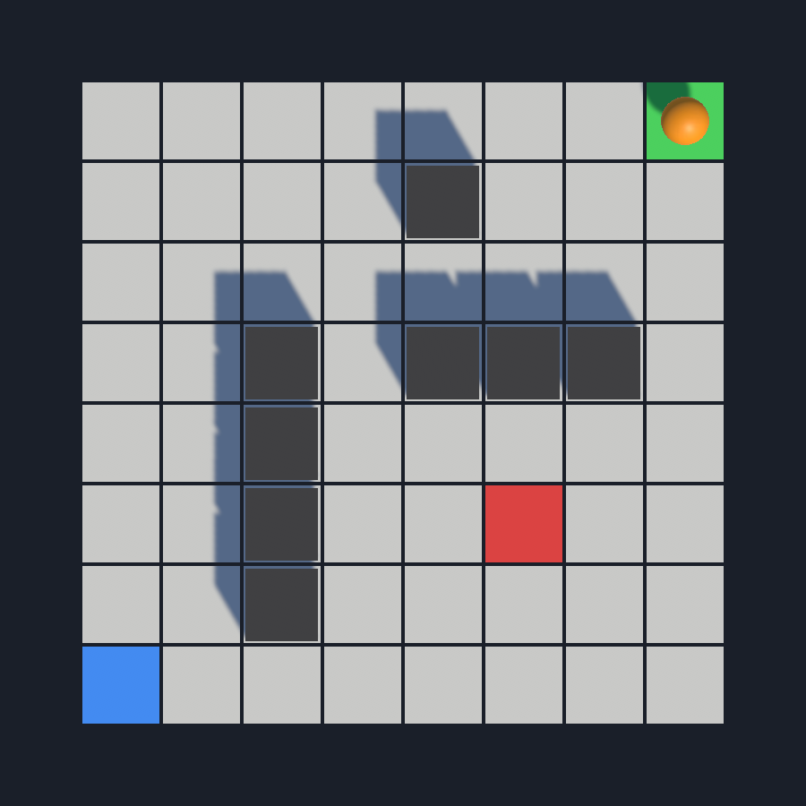
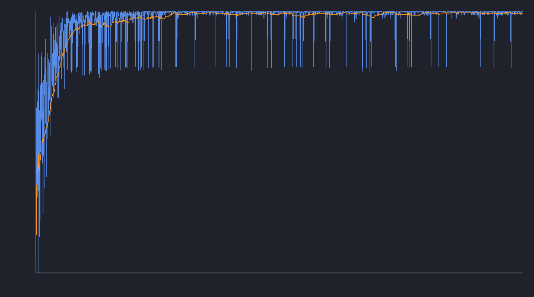

# Q-Learning in Unity

Demo de invatare prin intarire facut pentru lucrarea mea de licenta. Un agent invata singur, prin Q-Learning, sa ajunga de la start la tinta intr-o grila 8x8, evitand peretii si o capcana. Totul e scris in C# direct in Unity, fara biblioteci externe de machine learning.

## Ce face

- Mediu de tip grila 8x8 (start, tinta, capcana, pereti)
- Agent Q-Learning tabular: tabel Q, politica epsilon-greedy, update Bellman
- Antrenare cu vizualizare in timp real (agentul se misca pe grila, statistici live)
- Salveaza tabelul Q invatat intr-un fisier json
- Mod de evaluare care ruleaza politica invatata si scoate rezultatele in csv
- Genereaza si o curba de invatare (reward per episod)

## De ce ai nevoie

- Unity 6 (versiunea folosita: 6000.4.11f1)

## Cum rulezi

1. Cloneaza repo-ul si deschide folderul ca proiect in Unity Hub.
2. Deschide scena `Assets/Scenes/QLearningDemo.unity`.
3. Apasa Play.
4. La inceput agentul e neantrenat. Apasa **Train** ca sa porneasca antrenarea, o sa vezi cum se imbunatateste in panoul de statistici.
5. Dupa ce s-a antrenat, apasa **Run trained agent** ca sa vezi cum merge direct la tinta.

## Controale in demo

- **Train** - porneste antrenarea
- **Reset** - readuce agentul la zero (neantrenat)
- **Run trained agent** - ruleaza politica invatata din tabelul Q salvat
- **Slider de viteza** - cat de repede ruleaza simularea

## Structura

Scripturile sunt in `Assets/Scripts`:

- `GridEnvironment.cs` - mediul: stari, actiuni, tranzitii, recompense
- `QLearningAgent.cs` - tabelul Q, epsilon-greedy, update Bellman, salvare/incarcare
- `TrainingManager.cs` - bucla de antrenare, vizualizare, export rezultate
- `Evaluator.cs` - evalueaza politica invatata si scrie csv-ul
- `ChartRenderer.cs` - deseneaza curba de invatare
- `DemoController.cs` - leaga butoanele si sliderul de logica

## Rezultate

La finalul antrenarii se salveaza automat:

- `qtable.json` - tabelul Q invatat (in folderul persistent al aplicatiei)
- `training_rewards.csv` si `learning_curve.png` - in folderul `Results`
- `evaluation_results.csv` - rezultatele evaluarii

Dupa antrenare agentul ajunge la o rata de succes de 100% si gaseste traseul optim de 14 pasi.

## Lucrarea

Documentul lucrarii se gaseste in folderul `Thesis`.
